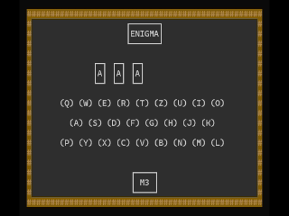

# EnigmaSim

EnigmaSim is an historically accurate Enigma machine simulator made in C++ (c++23).

## Installation

Download the `enigmasim` file on your Linux system or the `enigmasim.exe` file on Windows from the Release section.

## Requirements

If you want to compile the program by yourself you'll need either `PDCurses` (on Windows) or `Ncurses` (on Linux).

## How to use

Launch the `enigmasim` executable by command or double-click to launch the program normally.

If you want to have more options, launch from terminal and use arguments and options:

| Argument | Result | Option (after -skip) | Result |
|---|---|---|---|
| -info | Shows informations on the machine and the setup procedure. | -m3 | Loads default configuration for the standard M3 model (rotors III-II-I with base position 'A' and ring setting 'A', reflector 'B', and no plugs inserted). |
| -skip | Skips setup and loads default configuration depending on option selected. | -m4 | Loads default configuration for the uboat M4 model (rotors 'beta-III-II-I' with base position 'A' and ring setting 'A', reflector 'B thin', and no plugs inserted). |

## Purpose
EnigmaSim is a project which aimed at creating a working, historically accurate and mechanically faithful Enigma machine simulator while mastering a number C++ features and techniques.
As consequence it required to 1) understand how the Enigma worked and encrypted data and 2) how to translate its function to C++ while ensuring DRY code, readability and historical accuracy.

The main objective, and obstacle, was to simulate the actual mechanical and electrical behaviour of the machine. Therefore, to handle the components' configurations, were not used standard C++ library strings or vectors but rather classic "C-style" arrays and to handle the transformation of the signal were not used mathematical formulas but actual 'mechanical' simulation.

EnigmaSim employs all the basic features of C++ (control flow, strings, vectors, classes, structs, file management, pointers, etc) and the 'four pillars' of OOP.

## Features
EnigmaSim is intended to be fully fledged simulator and as such it has:
* complete and accurate encryption system with faithful mechanical/electrical behaviour simulation;
* two different kinds of historical models (M3 and M4) plus countless setting combinations;
* full set of rotors (I-VIII and beta and gamma) and reflectors (A, B, and C and 'thin' variants) just like the ones used between 1930 and 1945;
* simulation of 'double step' anomaly, ringstellung, grundstellung, etc;
* user-defined settings (machine model, rotors, reflectors and plugboard settings) via CLI guided setup;
* clean and simple text-based GUI with working lamps and rotors;
* file saving system (as .txt).

## License

[GPL3.0](https://choosealicense.com/licenses/gpl-3.0/)